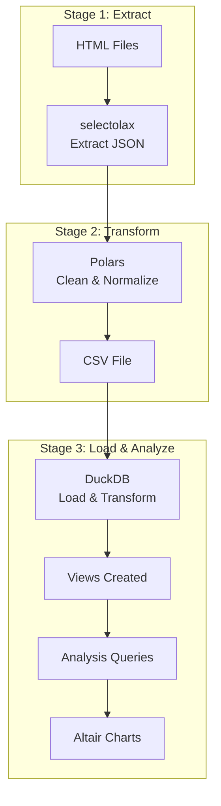

# SEO Mining and Analysis Pipeline

ETL pipeline for extracting, transforming, and analyzing SEO metrics from SimilarWeb data.

## Data Flow

## Task

5 scrapes of 5 websites have been made, which correspond to the websites here:
1. https://www.similarweb.com/website/byte-trading.com/#overview
2. https://www.similarweb.com/website/crunchbase.com/#overview
3. https://www.similarweb.com/website/pitchbook.com/#overview
4. https://www.similarweb.com/website/stripe.com/#overview
5. https://www.similarweb.com/website/google.com/#overview

## Step 1: Extract the data and store them in a single CSV file

Extract the following data points:
1. Global Rank
2. Total Visits
3. Bounce Rate
4. Pages per Visit
5. Avg Visit Duration
6. The change in rank over October, November and December
7. The total number of visits in October, November and December
8. Last Month Change in traffic
9. Top Countries
10. Age Distribution

## Step 2: Transform the extracted data, and load it into a DuckDB file

- Clean and normalise the data for example
  - The string "87.0B" is better represented as 87,000,000,000
  - The duration "00:10:35" is better represented as seconds 635
- Import the CSV into DuckDB
- Attempt to cast the data to data types, please don't cast all the data to Text

## Step 3: Analyze the data and plot the results on appropriate graphs and save the graphs as image files.

1. Month-on-month growth on the web visits
2. Month-on-month growth on the rank changes
3. Rank the results based on growth in visits and rank using a relative scale
